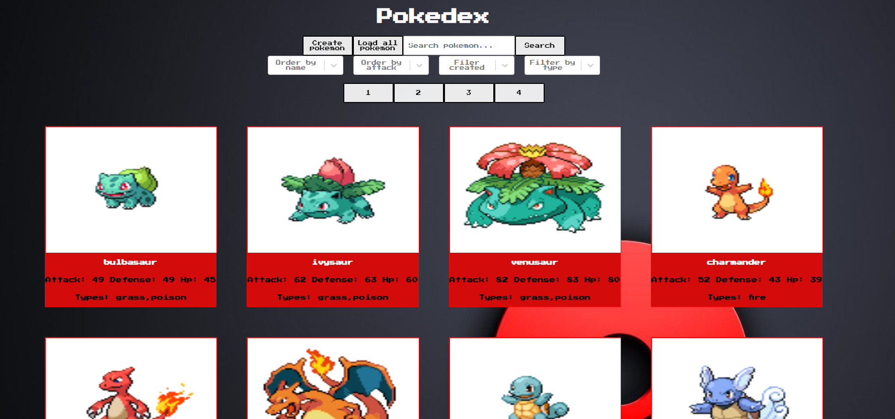
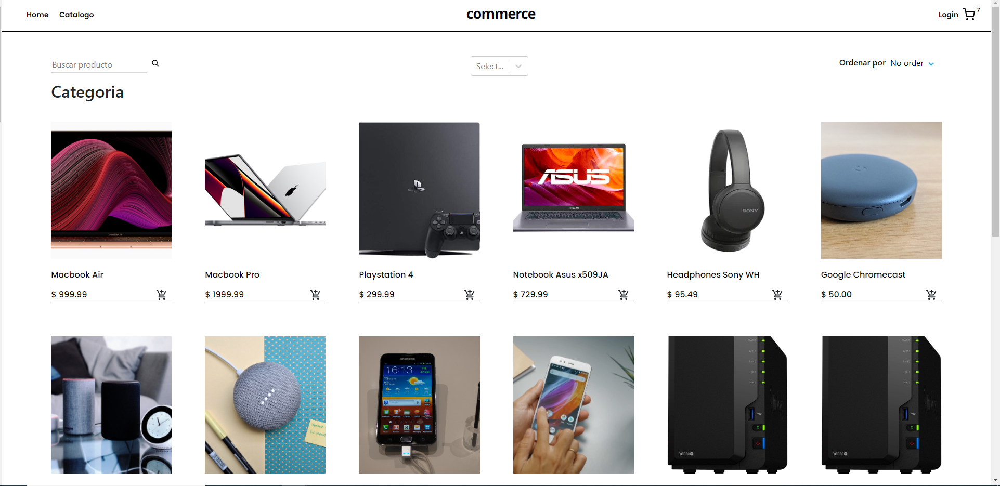
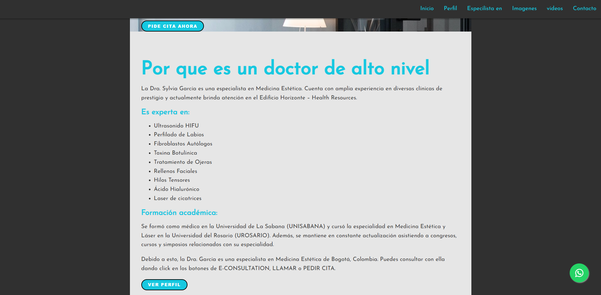

<!---
jozzol/jozzol is a ✨ special ✨ repository because its `README.md` (this file) appears on your GitHub profile.
You can click the Preview link to take a look at your changes.
- 👋 Hi, I’m @jozzol
- 👀 I’m interested in ...
- 🌱 I’m currently learning ...
- 💞️ I’m looking to collaborate on ...
- 📫 How to reach me ...
--->
<h1 align="center">Hey there! I'm Jose Garcia 👋 </h1>
<h3 align="center">Wev Developer | Javascript | React | HTML | CSS | SQL | Node.js | Express | Sequelize | Nextjs | Tailwind CSS | </h3>

 
  <h3> About Me </h3>

  - Im a Web developer interested in self improvent and to continue learning new technologies, Im passionate about creating and supporting project that can help others.
  - 📫 Reach me by 
    

 

<h3> Projects </h3>
<h2> Pokedex </h2>
created a pokedex using the information available from the pokemon API, it uses a front end with react and a backend with node and express.
the pokemon are brought to the backend where the original are saved and where is possible to store new created pokemons from the front end.
the pokedex also allow to filter by type, strength and name of the pokemon, it also allows to bring more information from specefic pokemon into their own page

<h2> Ecommerce </h2>
worked in a group using agile methodologies in order to recreate an ecommerce page, the front end was made using react, and the backend with node.
the main functions the project had were, showcasing the products from the backend to the frontend, creating and manipulating the products information from the front end via authenticated users with admin roles, the ability to sort the products and search for specific products, add new products to a queu in order to buy them using Stripe as the payment processing platform, and the ablity to send mail to the users regarding their purchases and wishlist items.

<h2> Bussiness page for a doctor </h2>
Web page made for a doctor, its made with react and CSS, it shows her bussiness informaiton, has links to their offered treatment details, counts with links to their whatsapp for contact, and showcases to their videos,

<h2> Weatherapp </h2>
simple add with react, its conected to the weather api, it brings cities information and showcases it, its able to sabe multiple cities and create personal dashboards.

  

  <h3> 💻 Languages and Tools </h3>
  

    <code></code>
    <code></code>
    <code></code>
    <code></code>
    <code></code>
    <code></code>
    <code></code>
    <code></code>
    <code></code>
  

 
